# Baby Feed

一款面向家庭的婴儿喂养与成长记录应用。它把每天零散的亲喂、瓶喂、辅食、睡眠、大小便和健康信息整理成清晰的今日概览、时间轴与趋势图，也可以通过提醒、Webhook、Web API 和配套 Agent Skill 连接家庭自动化与 AI 助手。

Baby Feed 支持手机和电脑浏览器，可安装为 PWA，也可以使用 Docker 部署到自己的服务器。账号、宝宝和记录数据保存在自己的 SQLite 数据库中。

> 本文截图中的“小满”和全部记录均为虚构数据。样本根据本地数据库的匿名记录频率与量级生成，仅用于展示界面，不代表推荐的喂养计划或医学建议。

## 项目特色

- **记录够完整**：亲喂、瓶喂母乳、配方奶和辅食都能分别记录；睡眠、大小便、体温、身高体重、疫苗、用药、长牙等信息也能放进同一条时间轴。
- **几秒完成一次记录**：首页提供可自定义的快捷入口，亲喂和睡眠支持实时计时，也可以事后补记。
- **容易回看和核对**：按天查看记录明细与汇总，编辑、删除或补充备注；统计页展示喂养时段、间隔、睡眠和成长趋势。
- **主动提醒**：支持喂养超时、每日定时、疫苗后测温和健康定期提醒，并可限制提醒生效时段。
- **多设备、多宝宝**：服务端支持多个相互隔离的账号，一个账号可管理多个宝宝；同一账号可在手机、平板和电脑上使用同一套数据。
- **数据可以流动**：通过 Webhook 把事件推送到微信、Telegram 或自动化平台，通过 Web API 让快捷指令、脚本和 Agent 安全读写记录。
- **配套 AI Skill**：仓库内置 `baby-feed-assistant` Skill，可接入 Hermes 等支持 Agent Skills 的系统，让 AI 基于宝宝的实际记录回答问题，而不是只给泛泛建议。
- **数据由自己掌握**：支持 Docker 自部署、SQLite 持久化和 PWA 安装；API Key 只保存哈希，并支持有效期和使用日志。

## 可以记录什么

### 喂养记录

| 类型 | 可以记录的内容 | 常见回看方式 |
|---|---|---|
| 亲喂母乳 | 左侧时长、右侧时长、开始/结束时间、备注 | 今日次数与总时长、左右侧比例、两次喂养间隔、时段热力图 |
| 瓶喂母乳 | 奶量、时间、备注 | 今日/多日总量、次数、每日趋势 |
| 配方奶 | 奶量、时间、备注 | 今日/多日总量、次数、每日趋势 |
| 辅食 | 食物名称、食用量、时间、备注 | 当日明细、食材尝试记录、统一时间轴 |

### 照护与健康记录

| 类型 | 可以记录的内容 |
|---|---|
| 大小便 | 小便、大便或两者都有，并可补充颜色、状态和其他观察 |
| 睡眠 | 入睡与醒来时间、睡眠质量、备注；支持跨午夜汇总 |
| 营养补充 | AD 与维生素 D 是否已补充 |
| 成长 | 体重、身高，以及由同日身高体重推算的 BMI 趋势 |
| 体温 | 温度、测量时间和备注 |
| 疫苗 | 疫苗名称、厂家、当前针次和总针次 |
| 用药 | 药品名称、剂量、时间和备注 |
| 长牙 | 具体乳牙位置、萌出时间和先后顺序 |
| 自定义健康记录 | 自定义项目名称、时间和备注 |
| 备忘 | 待办标题、说明、计划时间与完成状态 |

### 如何核对与追溯

每条记录同时保存实际发生时间以及创建、更新时间。家庭成员可以在时间轴中按日期核对详情，补充备注，或修正误记；统计页则帮助发现“记录是否缺失”和长期变化。

需要连接外部系统时，Webhook 可以订阅喂养、健康和备忘的新增、修改、删除事件，以及提醒触发事件。系统会对消息签名，并记录投递结果与重试状态。

Baby Feed 面向日常家庭记录，不是不可篡改的医疗审计系统。重要的异常情况或医疗决定仍应以医生意见和正式医疗记录为准。

## 主要页面

### 首页与快捷记录

<table>
  <tr>
    <td width="50%" align="center">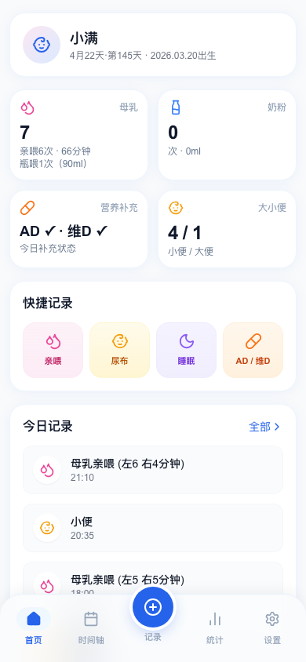</td>
    <td width="50%" align="center">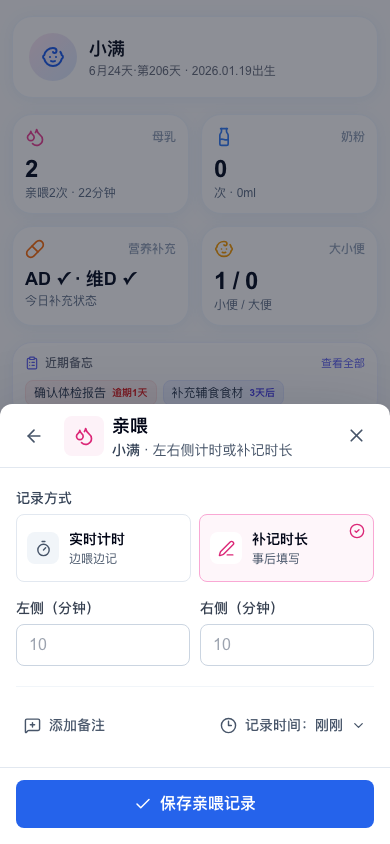</td>
  </tr>
  <tr>
    <td valign="top"><strong>首页</strong><br>打开即可看到今天的母乳、奶量、营养补充、大小便和最近记录。快捷入口可以在设置中按家庭习惯调整。</td>
    <td valign="top"><strong>记录面板</strong><br>从任意主页面点中间的“记录”按钮即可打开。亲喂和睡眠可实时计时，也可补记时间与备注。</td>
  </tr>
</table>

### 时间轴

<p align="center">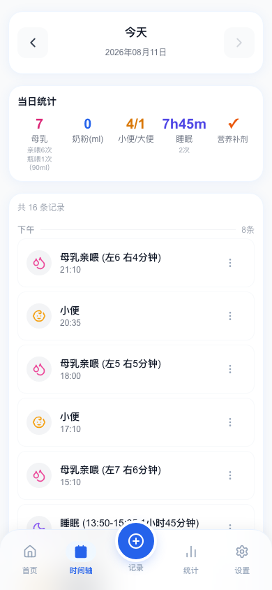</p>

时间轴把某一天的喂养、睡眠、大小便、营养补充和健康记录按时间排列，并在顶部给出当日汇总。可以切换到有记录的日期，也可以直接编辑或删除误记。

### 统计与洞察

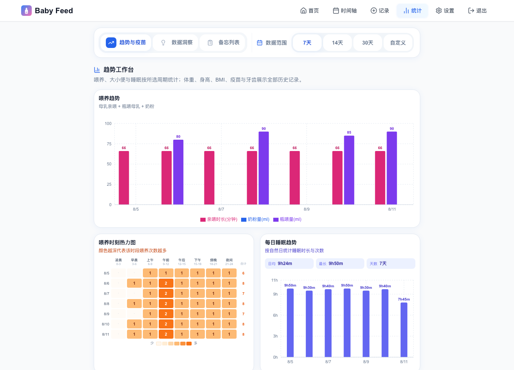

统计页提供 7 天、14 天、30 天和自定义日期范围。除了每日喂养量与时长，还能查看：

- 喂养时段热力图、平均间隔、最长间隔、夜间喂养和左右侧比例
- 每日睡眠总时长与次数、大小便趋势、AD 日历
- 体重、身高、BMI、体温趋势
- 疫苗针次进度、用药记录、长牙顺序与牙位图
- 数据洞察和独立的备忘列表

图表用于整理已有记录，不会替代生长曲线评估、诊断或医生建议。

### 身高与体重趋势

<table>
  <tr>
    <td width="50%" align="center">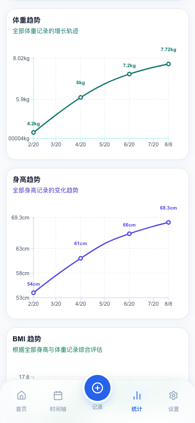</td>
    <td width="50%" align="center">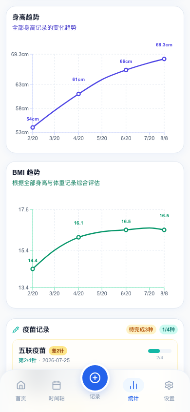</td>
  </tr>
  <tr>
    <td valign="top"><strong>体重趋势</strong><br>按实际测量日期连接全部历史记录，标出关键数值，适合在体检前快速整理一段时间内的变化。</td>
    <td valign="top"><strong>身高与 BMI</strong><br>身高使用独立趋势图；当身高和体重记录可以配对时，系统还会计算 BMI 供家庭回看。</td>
  </tr>
</table>

趋势图只反映已录入的家庭测量。测量工具、姿势和时间都可能影响结果，生长情况应结合月龄并由专业人员评估。

### 疫苗与牙齿成长

<table>
  <tr>
    <td width="50%" align="center">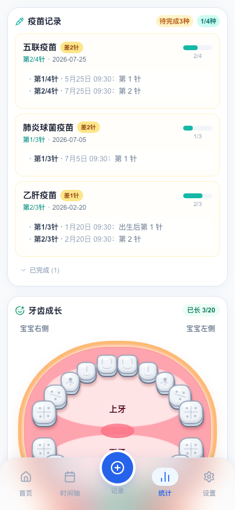</td>
    <td width="50%" align="center">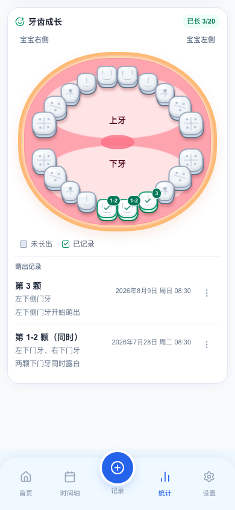</td>
  </tr>
  <tr>
    <td valign="top"><strong>疫苗进度</strong><br>同一种疫苗的多次接种会合并展示，当前针次、总针次、待完成数量和每次接种时间一目了然。</td>
    <td valign="top"><strong>牙齿成长</strong><br>在 20 颗乳牙的牙位图上标记已萌出牙齿，并按时间保留第几颗、同时萌出、具体位置和观察备注。</td>
  </tr>
</table>

疫苗页适合整理家庭记录，不能代替当地接种机构的正式凭证和接种安排；长牙时间存在明显个体差异。

### 备忘与待办

<p align="center">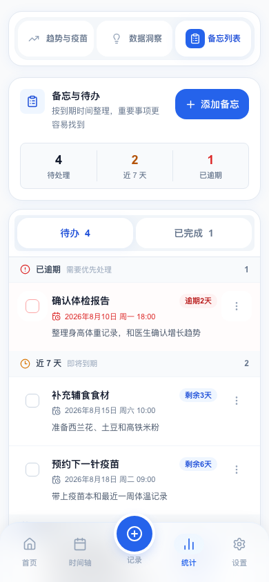</p>

备忘页把体检、疫苗预约、辅食准备等事项按 **已逾期、近 7 天、稍后** 自动分组，并单独保留已完成项目。每条备忘都可以补充说明、调整时间、标记完成或再次编辑。

### 设置与宝宝管理

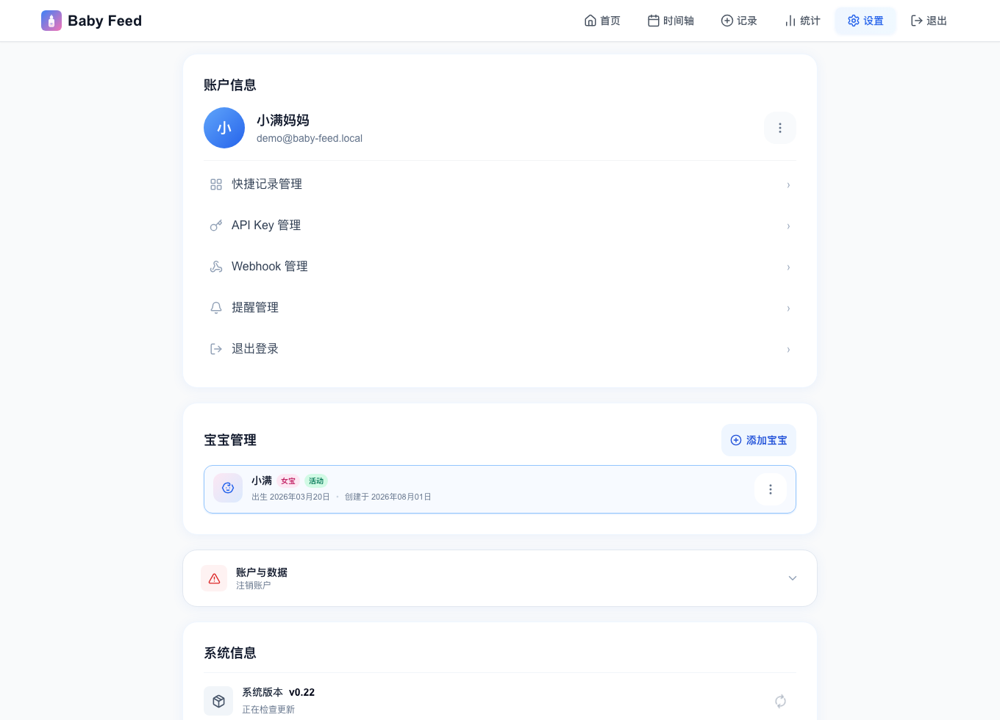

设置页集中管理账号、活动宝宝、快捷记录、API Key、Webhook 和提醒。一个账号可管理多个宝宝，切换活动宝宝后，首页、时间轴和统计会同步切换。

## Webhook 与提醒通知

### 智能提醒

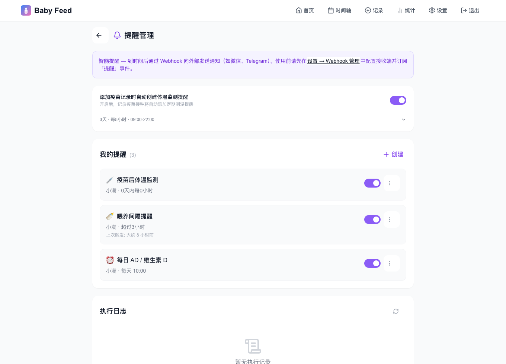

提醒不是简单的闹钟，它会结合记录判断是否需要触发：

- **喂养超时提醒**：距离上一次符合条件的喂养超过指定时间后提醒。
- **每日定时提醒**：每天固定时间提醒补充 AD、维生素 D、用药或其他事项。
- **疫苗后监测提醒**：接种后在限定窗口内，按设定频率提醒测量体温；也可在新增疫苗记录时自动创建。
- **健康定期提醒**：距离上次身高、体重、体温、大小便等记录超过指定周期后提醒。

每条规则都可以启停，并可设置生效时段，避免在夜间或不合适的时间打扰。触发结果会进入执行日志。

Baby Feed 通过 `reminder.fired` Webhook 把提醒送往外部接收端，实际通知可以由接收端转发到微信、Telegram、Discord、家庭自动化平台或 Agent。使用提醒时，部署者需要在唯一持有生产数据库的实例上启用 `REMINDER_ENABLED=true`。

### 实时 Webhook

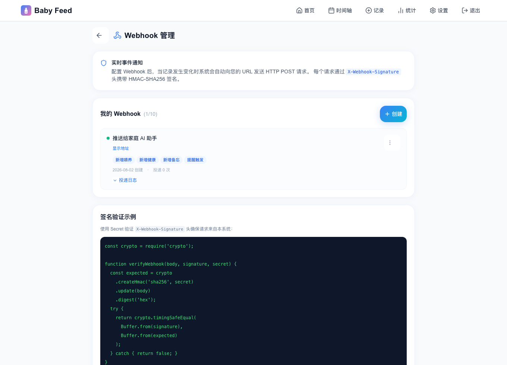

Webhook 可按需订阅以下事件：

- 喂养记录：新增、修改、删除
- 健康记录：新增、修改、删除
- 备忘录：新增、修改、删除
- 提醒：规则触发

每个接收地址都有独立密钥。请求使用 HMAC-SHA256 签名，失败投递会按规则重试，管理页面可以查看投递状态。接收端仍需先验证签名，再处理消息中的内容。

配置方法与消息格式见 [Webhook 文档](docs/WEBHOOKS.md) 和 [Webhook 部署指南](docs/WEBHOOK_SETUP.md)。

## Web API 与外部工具

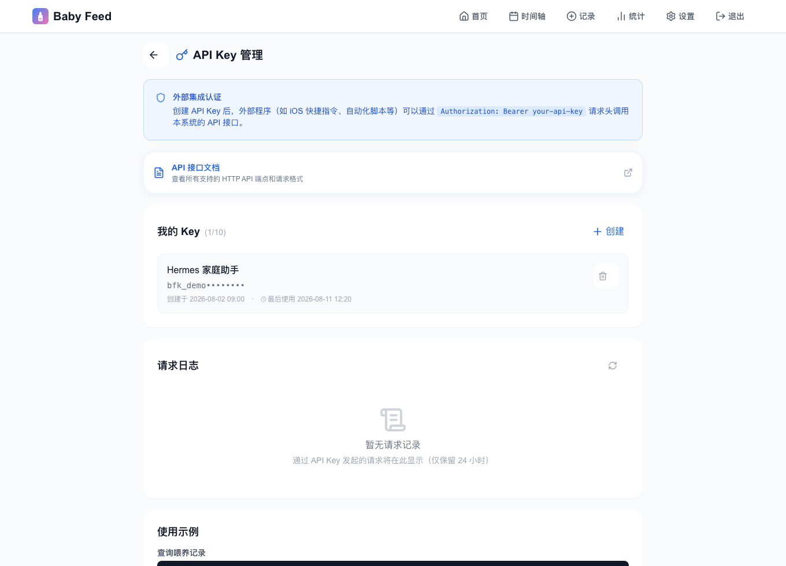

在 **设置 → API Key 管理** 中可以为不同工具创建独立密钥，例如“iOS 快捷指令”“Home Assistant”或“Hermes 家庭助手”。密钥只在创建时完整显示一次，数据库仅保存哈希；还可设置有效期，并查看最近 24 小时的请求日志。

Web API 覆盖宝宝资料、喂养、健康、睡眠摘要、统计、时间轴、备忘、提醒和快捷记录设置。它既能查询，也能新增、修改和删除记录，适合：

- 用手机快捷指令一键记录奶量或体温
- 把统计结果同步到家庭仪表盘
- 由自动化服务接收 Webhook 后查询更多上下文
- 让 AI Agent 在授权范围内读取或记录数据

全部端点、字段和示例见 [HTTP API 文档](docs/HTTP_REQUESTS.md)。

## 接入 Hermes 等 AI Agent

Baby Feed 自带独立维护的 [`baby-feed-assistant` Agent Skill](.agents/skills/baby-feed-assistant)。Hermes 兼容 [Agent Skills 开放标准](https://agentskills.io)，可以直接加载这套 Skill；其他能够读取 `SKILL.md` 并执行 HTTP 请求的 Agent 系统也可以使用。

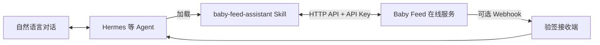

### AI 能做什么

Skill 不只是接口列表，它还规定了宝宝选择、北京时间、跨午夜睡眠、统计范围、写入校验、删除确认和健康信息边界。Agent 可以据此：

- 回答“宝宝今天吃了多少、睡了多久、换了几次尿布”
- 比较最近 7 天或自定义日期范围内的喂养、睡眠和成长趋势
- 根据实际记录讨论喂养间隔、夜间喂养变化或记录缺口
- 用自然语言新增亲喂、奶量、辅食、体温、用药、疫苗、长牙、备忘和提醒
- 通过接收端获得已验签的 Webhook，在新增记录或提醒触发后生成家庭可读的摘要

例如：

```text
你：小满今天整体怎么样？
Agent：先读取今天的喂养明细、统计、健康记录和睡眠摘要，再给出基于记录的概览。

你：最近一周夜间喂养是不是变多了？
Agent：查询 7 天统计中的时段分布和间隔，说明变化，并标出数据不足的日期。

你：记录一下刚瓶喂了 90 ml 母乳。
Agent：确认当前宝宝和北京时间后，通过 API 创建一条瓶喂记录并返回结果。
```

AI 给出的内容是对家庭记录的整理与一般性建议，不构成诊断。体温异常、喂养困难、过敏反应或生长担忧应及时咨询儿科医生。

### Hermes 接入步骤

先在 Baby Feed 的 **设置 → API Key 管理** 中创建一个专用 Key。然后在本项目根目录执行：

```bash
git submodule update --init --recursive
mkdir -p ~/.hermes/skills
ln -s "$PWD/.agents/skills/baby-feed-assistant" ~/.hermes/skills/baby-feed-assistant

cp .agents/skills/baby-feed-assistant/scripts/config.local.example \
  .agents/skills/baby-feed-assistant/scripts/config.local
chmod 600 .agents/skills/baby-feed-assistant/scripts/config.local
```

编辑 `config.local`：

```bash
BABY_FEED_BASE_URL=https://your-baby-feed-instance.example.com
BABY_FEED_API_KEY=bfk_your_api_key_here
```

在 Hermes 中新建会话，或执行 `/reload-skills` 重新扫描 `~/.hermes/skills/`。之后可以直接询问“宝宝今天吃了多少”，也可以通过 `/baby-feed-assistant` 明确调用该 Skill。

不要把 API Key 放进聊天内容、截图或仓库。建议为每个 Agent 单独创建 Key，便于停用和查看使用情况。

## 快速开始

已安装 Docker 和 Docker Compose 后：

```bash
git clone https://github.com/hxhb/baby-feed.git
cd baby-feed
cp .env.example .env
```

编辑 `.env`，至少替换 `NEXTAUTH_SECRET`，并把 `NEXTAUTH_URL` 改成浏览器实际访问的地址。随机密钥可用下面的命令生成：

```bash
openssl rand -base64 32
```

启动服务：

```bash
docker compose up -d --build
```

默认打开 `http://localhost:3000`，首次使用时注册账号并添加宝宝。持久化数据库位于宿主机的 `./data` 目录，请定期备份。

若需要手机从局域网或公网访问，请同时配置正确的 `NEXTAUTH_URL`、HTTPS 和反向代理。当前日期统计与提醒按北京时间处理。

## 文档

README 只保留普通用户需要了解的内容，部署和开发细节见：

| 文档 | 内容 |
|---|---|
| [HTTP API 文档](docs/HTTP_REQUESTS.md) | 认证方式、全部端点、字段、返回结构和示例 |
| [Webhook 文档](docs/WEBHOOKS.md) | 事件、签名、消息格式和接收端示例 |
| [Webhook 部署指南](docs/WEBHOOK_SETUP.md) | Webhook 运行、验证与排错 |
| [技术栈与数据模型](docs/TECH_STACK.md) | 技术选型、数据模型和认证设计 |
| [项目结构](docs/PROJECT_STRUCTURE.md) | 目录与主要模块说明 |
| [设计说明](docs/DESIGN.md) | 页面与视觉规范 |
| [添加记录交互设计](docs/add-record-interaction-design.md) | 记录面板的交互细节 |
| [Agent Skill](.agents/skills/baby-feed-assistant) | AI Agent 调用规则、脚本与参考资料 |

## 使用提醒

- 宝宝的喂养需求会随月龄、体重、健康状态和医生建议变化，不要把演示数据当作目标值。
- BMI、趋势图和 AI 摘要都来自已录入的数据；漏记或误记会直接影响结论。
- 自部署意味着数据由部署者负责，请使用强密码、HTTPS、可靠备份，并及时更新应用。

## 许可证

MIT License

欢迎通过 Issue 和 Pull Request 参与改进。
